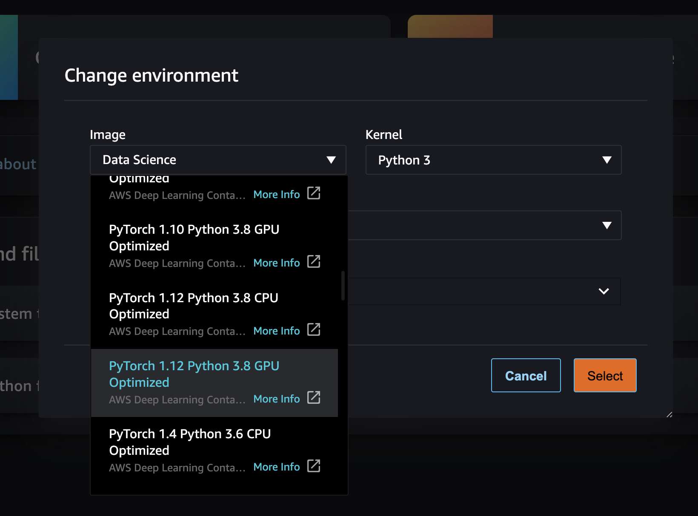
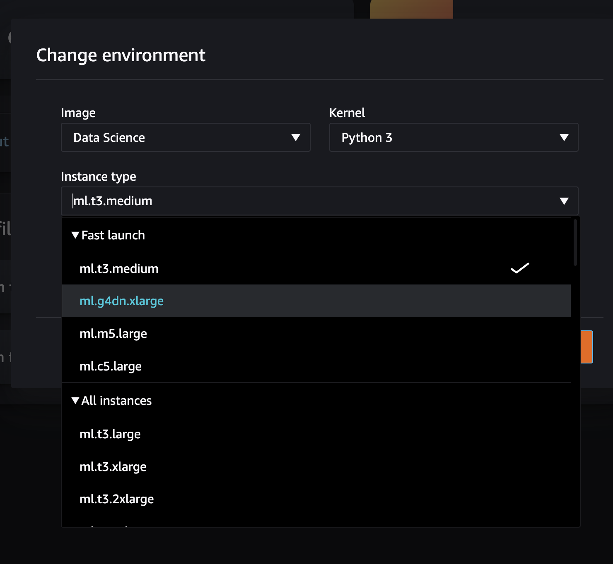
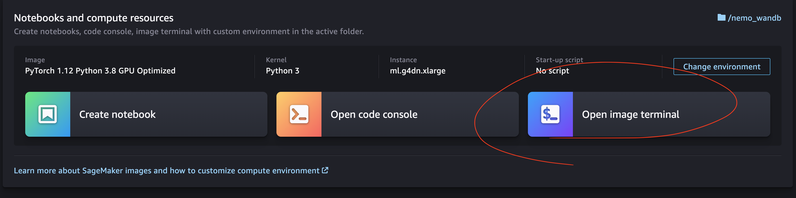

# Nemo and W&B workshop

Here is the code for the workshop "Training and Tunning a Text to speech model with Nvidia NeMo and Weights and Biases".

## Installation

If you are running in SageMaker you will have to choose an image with Pytorch and GPU capabilities. 
- Choose Pytorch image from the `Environment` drop down menu


- Choose a GPU equiped machine


- Open a terminal on the machine and clone this repo using `git clone`


- Run the `setup.sh` script inside the Machine Image terminal.
```
> bash sm_setup.sh
```


## Running the code

Follow the notebooks in order

- [01_log_datasets.ipynb](01_log_datasets.ipynb) will download the data and create a train/valid split. You will learn how to store your data on Weights and Biases.
- [02_FastPitch_finetune.ipynb](02_FastPitch_finetune.ipynb) You will fine tune a `FastPitch` model on a particular speaker. We will then analyse the results using `wandb.Tables`s
- [03_HiFIGAN_finetune.ipynb](03_HiFIGAN_finetune.ipynb) Improve previous results by finetunning the HiFiGan model with the data from the new speaker!
- [04_final_validation.ipynb](04_final_validation.ipynb) Analyse the final results after both finetunnings.

## Notes

- You will need a machine with at least 16GB of VRAM. You can try decreasing batch size on smaller machines, but you will need to adjust the steps accordingly.
- The checkpoints `exp_dir`use a lot of space, and also the `~/.cache` gets heavy quickly. You can safely delete this as it will re-download if necessary.
- The `9017` speaker data is really small, so the model performance is not very good. 

## Bring your own dataset

You can create a dataset of your own, also using `NeMo` ASR features. 
- Pitch metrics are needed from your data: [script](https://raw.githubusercontent.com/NVIDIA/NeMo/main/scripts/dataset_processing/tts/compute_speaker_stats.py) can help you out 😎
- You will need to normalize your text inputs, check [this notebooks](https://github.com/NVIDIA/NeMo/blob/main/tutorials/text_processing/Text_(Inverse)_Normalization.ipynb).
- The expected audio files need to be in 22050Hz as sample rate. You can export your data with `from scipy.io.wavfile import write`.